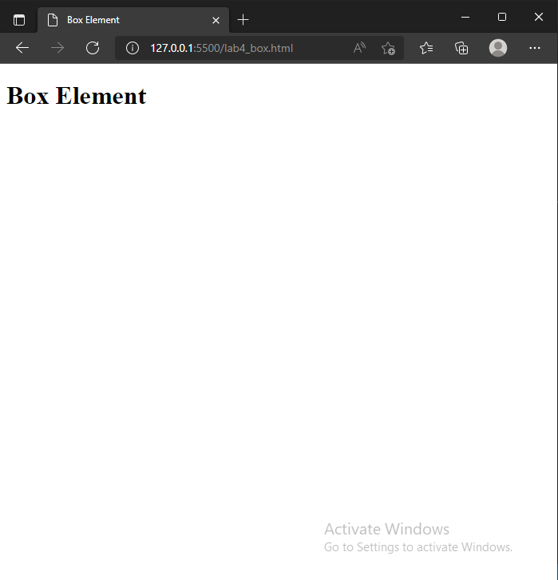
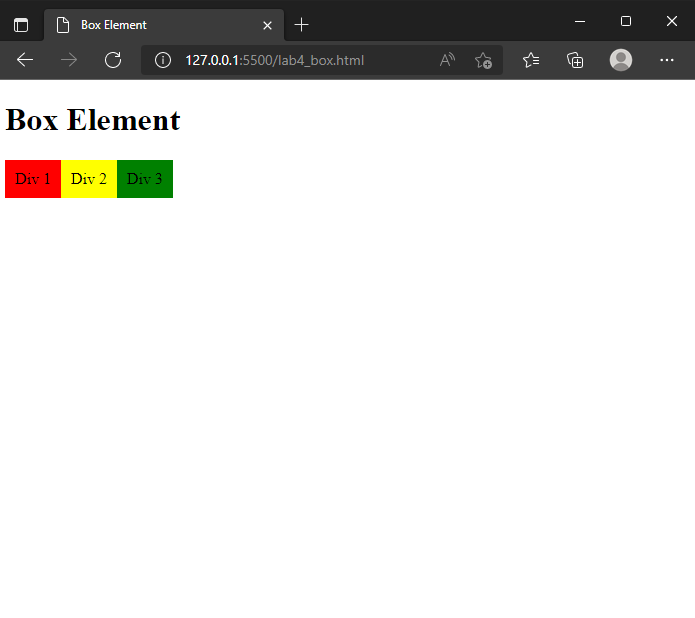
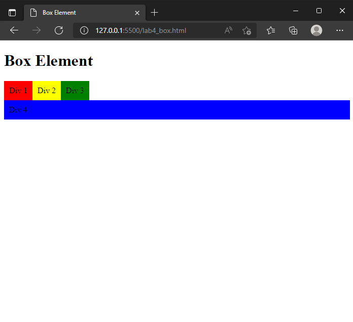
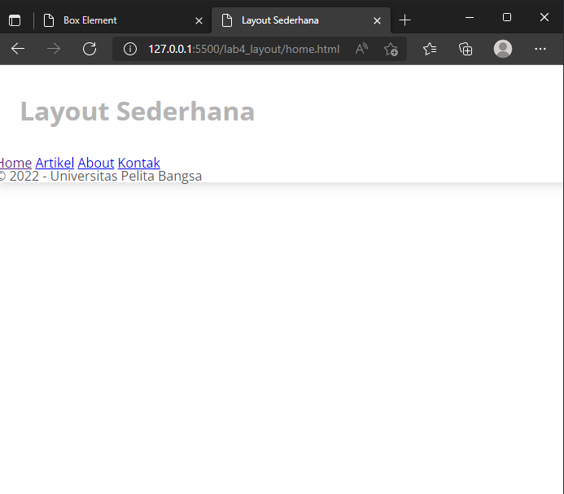
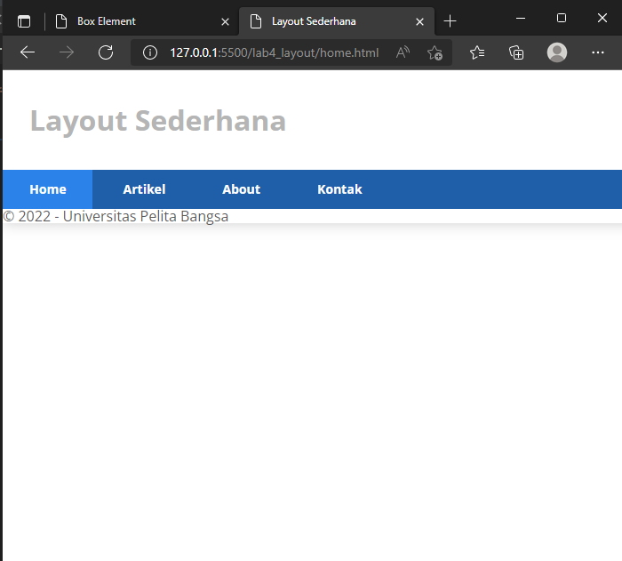
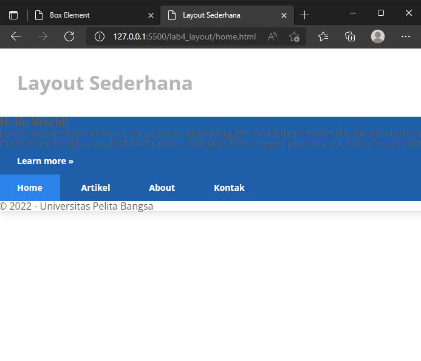
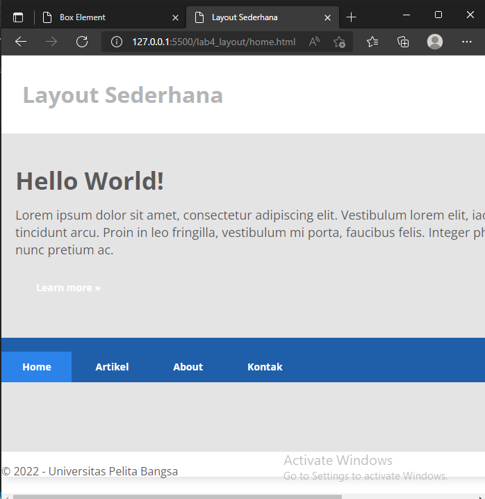

# Tugas Lab4web
## Profil

| #               | Biodata             |
| --------------- | ------------------- |
| **Nama**        | Firman Maulana      |
| **NIM**         | 312010266           |
| **Kelas**       | TI.20.A.2           |
| **Mata Kuliah** | Pemrograman Web     |

## Langkah 1

### Membuat dokumen HTML dengan nama file `lab4_box.html` Setelah itu buat struktur dasar HTML
``` html
<!DOCTYPE html>
<html lang="en">
<head>
  <meta charset="UTF-8">
  <meta name="viewport" content="width=device-width, initial-scale=1.0">
  <title>Box Element</title>
</head>
<body>
  <header>
    <h1>Box Element</h1>
  </header>
</body>
</html>
```

* Maka hasilnya seperti ini


## Langkah 2 
### Membuat box element dengan tag div
```html 
<section>
  <div class="div1">Div 1</div>
  <div class="div2">Div 2</div>
  <div class="div3">Div 3</div>
</section>
```
* Maka Hasilnya seperti ini


## Langkah 3 
### Tambahkan deklarasi CSS pada head untuk membuat float element
``` html
<style>
        div {
            float:left;
            padding: 10px;
        }
        .div1 {
            background: red;
        }
        .div2 {
            background: yellow;
        }
        .div3 {
            background: green;
        }
</style>
```
* Maka hasilnya akan seperti ini


## Langkah 4
### Mengatur Clearfix Element. Clearfix digunakan untuk mengatur element setelah float element
1. Tambahkan element div lainnya seteleah div3
``` html 
<section>
  <div class="div1">Div 1</div>
  <div class="div2">Div 2</div>
  <div class="div3">Div 3</div>
  <div class="div4">Div 4</div>
</section>
```
2. Kemudian atur property clear pada CSS
```html
<style>.div4 {
  background-color: blue;
  clear: left;
  float: none;
}
```
* Maka hasilnya akan seperti ini


## Membuat layout sederhana
### Langkah 1
1. Buat folder baru dengan nama `lab4_layout`, kemudian buatlah file baru didalamnya dengan nama `home.html` dan file css dengan nama `style css`
* contohnya seperti ini


2. Kemudian coding `home.html`
``` html
<!DOCTYPE html>
<html lang="en">
<head>
    <meta charset="UTF-8">
    <meta name="viewport" content="width=device-width, initial-scale=1.0">
    <title>Layout Sederhana</title>
    <link rel="stylesheet" href="style.css">
</head>
<body>
    <div id="container">
        <header>
            <h1>Layout Sederhana</h1>
        </header>
        <nav>
            <a href="home.html" class="active">Home</a>
            <a href="artikel.html">Artikel</a>
            <a href="about.html">About</a>
            <a href="kontak.html">Kontak</a>
        </nav>
        <section id="hero"></section>
        <section id="wrapper">
            <section id="main"></section>
            <aside id="sidebar"></aside>
        </section>
        <footer>
            <p>&copy; 2021 - Universitas Pelita Bangsa</p>
        </footer>
    </div>
</body>
</html>
```
* Maka hasilnya akan seperti ini


2. dan coding pada file `css`
```css
/* import google font */
@import
url('https://fonts.googleapis.com/css2?family=Open+Sans:ital,wght@0,300;0,400;0,600;0,700;0,800;1,300;1,400;1,600;1,700;1,800&display=swap');
@import
url('https://fonts.googleapis.com/css2?family=Open+Sans+Condensed:ital,wght@0,300;0,700;1,300&display=swap');

/* Reset CSS */
* {
    margin: 0;
    padding: 0;
}
body {
    line-height:1;
    font-size:100%;
    font-family:'Open Sans', sans-serif;
    color:#5a5a5a;
}
#container {
    width: 980px;
    margin: 0 auto;
    box-shadow: 0 0 1em #cccccc;
}

/* header */
header {
    padding: 20px;
}
header h1 {
    margin: 20px 10px;
    color: #b5b5b5;
}
```
* hasilnya akan seperti ini


## Langkah 2
### Mengatur Navigasi pada CSS
``` css
/* navigasi */
nav {
    display: block;
    background-color: #1f5faa;
}
nav a {
    padding: 15px 30px;
    display: inline-block;
    color: #ffffff;
    font-size: 14px;
    text-decoration: none;
    font-weight: bold;
}
nav a.active,
nav a:hover {
    background-color: #2b83ea;
}
```
* Maka Hasilnya akan seperti ini


## Langkah 2
### Membuat Hero Panel
* Tambahkan coding pada `home.html`
``` html
<section id="hero">
    <h1>Hello World!</h1>
    <p>Lorem ipsum dolor sit amet, consectetur adipiscing elit. Vestibulum lorem
elit, iaculis innisl volutpat, malesuada tincidunt arcu. Proin in leo fringilla,
vestibulum mi porta, faucibus felis. Integer pharetra est nunc, nec pretium nunc
pretium ac.</p>
    <a href="home.html" class="btn btn-large">Learn more &raquo;</a>
</section>
```
* Maka hasilnya akan seperti ini


### Tambahkan coding pada `style_css`
``` css
#hero {
    background-color: #e4e4e5;
    padding: 50px 20px;
    margin-bottom: 20px;
}
#hero h1 {
    margin-bottom: 20px;
    font-size: 35px;
}
#hero p {
    margin-bottom: 20px;
    font-size: 18px;
    line-height: 25px;
}
```
* Maka hasilnya akan seperti ini



